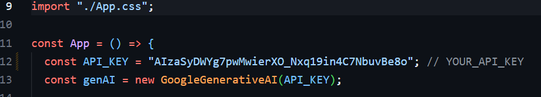

# Gemini GPT - Conversational AI Chat Bot

Gemini GPT is an open-source AI chat bot powered by Google's Generative AI. Engage in dynamic conversations, ask questions, and receive intelligent responses.

## Features

- Conversational AI using Google's Generative AI API
- Code generation with syntax highlighting
- Open-source and customizable

## Tech Stack

- **React:** A JavaScript library for building user interfaces.
- **@google/generative-ai:** Google's Generative AI API for natural language processing.
- **react-markdown:** Converts Markdown text into React components.
- **react-syntax-highlighter:** Syntax highlighting for code blocks in React.
- **react-icons:** A collection of customizable icons for React.

## Usage

1. Clone the repository:
   `git clone https://github.com/yashj09/Gemini-GPT.git`
2. Get you api key from https://makersuite.google.com/app/apikey
   
   and replace with exciting api key
3. Install dependencies:
   `npm install`
4. Start the development server:
   `npm start`

## How to Contribute

If you'd like to contribute to Gemini GPT, follow these steps:

1. Fork the repository
2. Create a new branch:
   `git checkout -b feature/new-feature`
3. Make your changes and commit:
   `git commit -m 'Add new feature'`
4. Push to your branch:
   `git push origin feature/new-feature`
5. Open a pull request

## License

This project is licensed under the MIT License - see the [LICENSE](LICENSE) file for details.

---

Made with ❤️ by Yash Jain

Connect with me on [LinkedIn](https://www.linkedin.com/in/yash-jain-5a92861ab/) | Follow me on [Twitter](https://twitter.com/0xYash_Jain) | Check out my [GitHub](https://github.com/yashj09)
